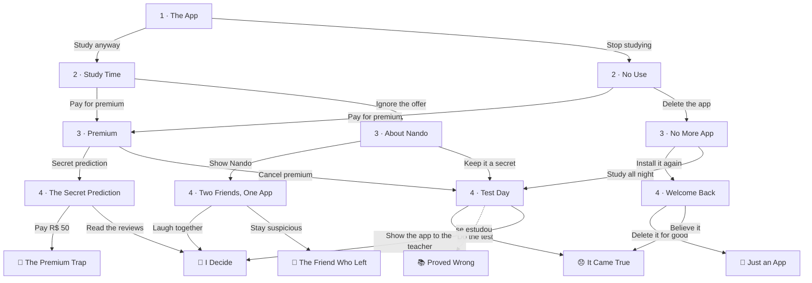

# The Fortune App — roteiro

**Turma:** 1º ano, 4º bimestre (*What Comes Next?*) · **Nível:** A2
**Conteúdos:** Simple future (*will* × *going to*), simple past, question words
**Tema de fundo:** responsabilidade pelas próprias escolhas, e golpes de aplicativos "gratuitos".
**Formato:** 4 escolhas por leitura, 16 caminhos, 6 finais. Entre 320 e 375 palavras por caminho.

O `story.json` desta pasta já está no formato da *Story Shelf* e passou no
`checar.py`. Os 16 caminhos também foram jogados pela interface, com
ilustrações provisórias. Falta só desenhar as ilustrações (`scenes.js`).

---

## A história

Léo, aluno do 1º ano, baixa o *FutureMe*, um aplicativo gratuito que promete
prever o futuro. A primeira previsão acerta: *"It's going to rain at 4 p.m."*,
e chove mesmo. A segunda assusta: *"You will fail the math test on Friday."*

**Como o futuro entra:** a narração continua no **passado**, como em todos os
livros da estante, então o caderno de detetive e o reconto funcionam igual.
O futuro aparece onde ele é natural: nas **previsões do aplicativo**, sempre
em balões de mensagem (*will*, *won't*, *going to*), e nas falas dos
personagens. É um bom material para discutir a diferença: *"It's going to rain"*
(há sinais) × *"You will fail"* (previsão sem evidência).

**A verdade:** o *FutureMe* manda **as mesmas previsões genéricas para todo
mundo**, só trocando o nome. A chuva acertou porque o app copia a previsão do
tempo. O objetivo real é vender a versão paga. E a previsão da prova só se
cumpre se o Léo acreditar nela e parar de estudar: é uma profecia que se
realiza sozinha.

**Personagens:** Léo (protagonista), Nando (melhor amigo), a mãe do Léo e a
Professora Ana (matemática).

---

## Mapa dos caminhos

A seta pontilhada é um desvio automático: fazer a prova leva a *Proved Wrong*
para quem estudou, e a *It Came True* para quem desistiu.

**Marcas que o leitor carrega:**

| Marca | Quando acontece | O que muda |
|---|---|---|
| `studied` | decidiu estudar no cap. 1, ou estudou a noite toda no cap. 3 | Em *Test Day*, ele sabe as respostas; fazer a prova leva a *Proved Wrong* |
| `lastminute` | estudou a noite toda no cap. 3 | Em *Test Day*, aparece cansado, mas com a matéria fresca |
| `gaveup` | parou de estudar no cap. 1 | Em *Premium*, gasta o tempo todo no app |
| `paid` | pagou a versão premium | Em *Proved Wrong*, cancela a assinatura |

---

## Capítulos e caderno de detetive

| Capítulo | O que acontece | Pergunta do caderno | Escolhas |
|---|---|---|---|
| **1 · The App** | Léo baixa o app; a previsão da chuva acerta; chega a previsão da prova. | **What** did the app predict first? | *Study for the test anyway* · *Stop studying. It's no use!* |
| **2 · Study Time** | Léo estuda com o Nando, que ri do app; chega a oferta da versão paga. | **Who** studied with Léo? | *Pay for premium* · *Ignore the offer* |
| **2 · No Use** | Léo joga videogame; a mãe diz "You decide"; chega a oferta paga. | **Why** did Léo stop studying? | *Pay for premium* · *Delete the app* |
| **3 · About Nando** | Nova previsão: o Nando vai mentir amanhã. Léo fica desconfiado. | **When** was Nando going to lie? | *Show the prediction to Nando* · *Keep it a secret* |
| **3 · Premium** | Léo paga com o dinheiro do lanche; as previsões são bonitas e vazias; oferta de previsão secreta. | **How much** did premium cost? | *Try to get the secret prediction* · *Cancel premium and think about the test* |
| **3 · No More App** | Léo apaga o app, se sente livre, mas sente falta. | **How** did Léo feel? | *Install the app again* · *Study all night* |
| **4 · Two Friends, One App** | O Nando mostra que recebeu a mesma previsão sobre o Léo. | **Whose** phone had the same prediction? | *Laugh together at the app* · *Stay suspicious of Nando* |
| **4 · Test Day** | Prova às 7:30; o app manda "Your future starts now". | **What time** did the test start? | *Turn off the phone and do the test* · *Show the app to the teacher after the test* |
| **4 · The Secret Prediction** | Léo pede R$ 50 ao Nando; o Nando sugere ler as avaliações. | **Where** was the golden button? | *Pay for the secret prediction* · *Read the reviews with Nando* |
| **4 · Welcome Back** | O app volta: "Nothing can change that." | **When** was the math test? | *Delete it for good and study a little* · *Believe it and go to sleep* |

Cada caminho pratica 4 ou 5 question words diferentes.

---

## Os 6 finais

| Final | Faixa | O que acontece | Caminhos |
|---|---|---|---|
| 🔮 **I Decide** | bom | Léo descobre que o app manda as mesmas previsões para todo mundo e escreve no caderno: *"My future? I decide."* | 7 de 16 |
| 📚 **Proved Wrong** | bom | Tira 8,5 e manda ao app uma avaliação: *"Your prediction was wrong."* | 3 de 16 |
| 🤷 **Just an App** | intermediário | Apaga o app, estuda um pouco, passa com 6,0 e nunca descobre como o app funcionava. | 1 de 16 |
| 💸 **The Premium Trap** | intermediário | Paga R$ 50 pela previsão secreta: *"Good things will happen to you soon."* Perdeu R$ 70 na semana. | 2 de 16 |
| 😞 **It Came True** | ruim | Tira 3,0. O Nando: *"The app didn't make you fail. You believed it."* | 2 de 16 |
| 🧊 **The Friend Who Left** | ruim | Léo desconfia do Nando, que vai embora: *"Do you trust an app more than you trust me?"* | 1 de 16 |

**Uma observação para você decidir:** *I Decide* é o final de 7 dos 16
caminhos, porque três rotas diferentes levam à descoberta do golpe (o celular
do Nando, a professora, as avaliações na internet). Isso reforça a mensagem do
livro, mas deixa esse final fácil de encontrar. Se quiser mais equilíbrio, dá
para mudar a segunda escolha de *Test Day* para levar a outro final.

---

## Ilustrações para desenhar (`scenes.js`)

Mesmo estilo dos outros livros: SVG 540 × 220, com `person()`, `SKY()` e
`GROUND()`. **Nomes sem hífen.** O app *FutureMe* pode ter uma identidade
visual própria e reconhecível em todas as cenas: tela roxa com uma bola de
cristal 🔮.

**Personagens:** **Léo** (cabelo cacheado, moletom), **Nando** (cabelo curto,
camiseta de time), **a mãe** e a **Professora Ana** (óculos, blusa social).

| Cena | Onde aparece | O que mostrar |
|---|---|---|
| `phone_ad` | capa, cap. 1 | Léo olhando o celular com o anúncio do *FutureMe* brilhando; do lado, uma janela com nuvens de chuva chegando. |
| `study` | cap. 2 (*Study Time*) | Léo e Nando numa mesa com caderno, equações e um notebook. |
| `gaming` | cap. 2 (*No Use*) | Léo no sofá com o controle do videogame; livro de matemática fechado no chão; a mãe na porta. |
| `classroom` | cap. 3 (*About Nando*) | Sala de aula; Léo olhando de lado, desconfiado, para o Nando, que está distraído. |
| `premium` | cap. 3 (*Premium*), cap. 4 (*The Secret Prediction*), final *The Premium Trap* | Celular com tela dourada, coroa e cadeado: "UNLOCK YOUR SECRET PREDICTION". |
| `no_app` | cap. 3 (*No More App*), final *Just an App* | Quarto à noite; celular virado para baixo; Léo com o livro aberto; xícara de café. |
| `friends` | cap. 4 (*Two Friends, One App*) | Léo e Nando lado a lado, cada um mostrando o próprio celular com a mesma mensagem. |
| `test` | cap. 4 (*Test Day*) | Sala de prova; relógio marcando 7:30; a professora distribuindo folhas; celular vibrando no bolso do Léo. |
| `night` | cap. 4 (*Welcome Back*) | Quarto escuro, relógio às 10:00, livro aberto na cama, celular iluminando o rosto do Léo. |
| `truth` | final *I Decide* | Muitos celulares iguais, todos com a mesma previsão; no centro, o caderno do Léo com "My future? I decide." |
| `grade` | final *Proved Wrong* | Prova com 8,5 em vermelho; Léo sorrindo e tirando foto. |
| `grade_bad` | final *It Came True* | Prova com 3,0; Léo cabisbaixo; o Nando ao lado, sério. |
| `friends_apart` | final *The Friend Who Left* | Corredor da escola; o Nando indo embora de costas; Léo parado com o celular na mão. |

---

## Instruções para o Claude Code

1. Copie o `story.json` para `fonte/stories/the-fortune-app/story.json`.
2. Crie `fonte/stories/the-fortune-app/scenes.js` com as 13 cenas acima,
   registradas em `SCENE_LIB["the-fortune-app"]`.
3. Acrescente `{"slug": "the-fortune-app", "published": false}` ao
   `fonte/shelf.json`.
4. Rode `python3 fonte/checar.py` e `python3 fonte/build.py --drafts`, e leia ao
   menos dois caminhos em largura de celular.
5. Só mude para `"published": true` quando o professor aprovar.

**Uma armadilha nova do glossário, já tratada neste livro:** em *going to*, a
palavra *going* seria reconhecida como forma do verbo *go* e mostraria
*go · went*. Isso ensinaria errado justamente o futuro. Por isso, todo
*going to* do texto está marcado como `[[going to|vai + verbo (futuro)]]`.
**Sugestão de melhoria no motor:** o template poderia reconhecer *going to*
sozinho como expressão de futuro, e o `checar.py` poderia avisar quando
encontrar um *going* solto. Assim, quem escrever os próximos livros não
precisa lembrar disso.

Os dois pontos anotados no roteiro de *Who Posted It?* continuam valendo: a
ordem do `alt` (este livro usa no máximo um desvio por escolha, então não é
afetado) e os nomes de cena sem hífen.
