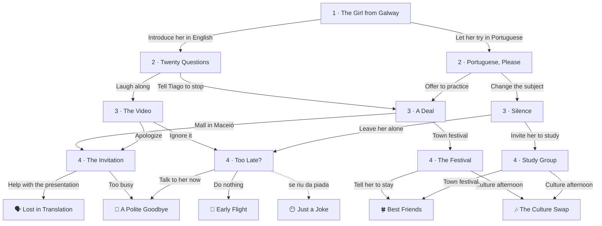

# The New Student — roteiro

**Turma:** 2º ano · **Nível:** B1
**Conteúdos:** Present perfect (*ever, never, already, yet, for*), simple past, past continuous
**Tema de fundo:** acolhimento e preconceito. A "brincadeira" que machuca, e a diferença entre não fazer nada de errado e fazer algo certo.
**Formato:** 4 escolhas por leitura, 16 caminhos, 6 finais. Entre 505 e 650 palavras por caminho.

O `story.json` desta pasta já está no formato da *Story Shelf* e passou no
`checar.py`. Os 16 caminhos também foram jogados pela interface, com
ilustrações provisórias. Faltam as ilustrações (`scenes.js`) e **uma melhoria
no motor**, explicada no fim, para o balão dos verbos mostrar o particípio.

---

## O que faz deste livro um B1

Comparado com *The Phone on the Bus* (A2), medido no texto:

| Medida | The Phone on the Bus (A2) | The New Student (B1) |
|---|---|---|
| Palavras por caminho | 400–450 | 505–650 |
| Palavras por frase (média) | 7,8 | 11,7 |
| Present perfect | 0 | 18 |
| Past continuous | 1 | 14 |
| Conectivos (*however, although, while, meanwhile...*) | 0 | 11 |

Além disso:
- **O caderno de detetive vai além de localizar informação.** Tem perguntas de
  **inferência** (*Why did Aoife's cheeks turn red?*, *How did she feel?*) e de
  **vocabulário em contexto** (*What is a "buddy" in this story?*,
  *How long was Aoife in Brazil...?*).
- **O reconto é maior:** 6 frases e pelo menos 4 sequence words diferentes, em
  vez de 5 e 3. O próprio texto de cada caminho usa ao menos 4 delas, para dar
  o modelo do que é cobrado.
- **O vocabulário é mais rico**, com glossário de toque em palavras como
  *stared, pretended, whispered, hesitated, gathered* e *endless*.

---

## A história

Professor Marcos, coordenador do IFAL Viçosa, pede ao Kaio, o melhor aluno de
inglês do 2º ano, que seja o *buddy* de Aoife: uma estudante de intercâmbio de
Galway, na Irlanda, que vai passar um semestre na escola e sabe três palavras
em português (*obrigada, bom dia, tapioca*).

O *present perfect* aparece onde é natural: nas perguntas entre as duas
culturas (*"Have you ever eaten tapioca?" "Not yet, but I've already heard a
lot about it!" "Have you ever been abroad?" "I've never left Alagoas."*) e nos
momentos de balanço (*"I've been here for a month, and I haven't made a single
friend."*).

**O conflito:** Tiago, o palhaço da turma, imita o sotaque dela
(*"Hi! I'm from Ai-er-land!"*) e olha para o Kaio, esperando que ele ria também.

**Detalhes culturais**, todos verdadeiros: em inglês irlandês, *"grand"* quer
dizer "OK"; *"Mam"* é "mãe"; *soda bread* é um pão típico. Os lugares de Viçosa
são genéricos (a praça, a festa da cidade), sem afirmar fatos sobre eventos
reais.

**Personagens:** Kaio (protagonista), Aoife (intercambista), Júlia (amiga do
Kaio), Tiago (o palhaço da turma), Professor Marcos (coordenador) e Vó Neide
(avó do Kaio).

---

## Mapa dos caminhos

**Marcas que o leitor carrega:**

| Marca | Quando acontece | O que muda |
|---|---|---|
| `laughed` | riu da imitação do Tiago | O vídeo circula; em *The Invitation*, Kaio pede desculpas; em *Too Late?*, surge um sticker com o rosto dela, e não fazer nada leva a *Just a Joke* |
| `defended` | mandou o Tiago parar | Em *A Deal*, Aoife agradece: *"Nobody has ever defended me like that."* |
| `mall` | levou Aoife ao shopping | Em *The Invitation*, o passeio foi "bom, mas não especial" |

---

## Capítulos e caderno de detetive

| Capítulo | O que acontece | Pergunta do caderno | Escolhas |
|---|---|---|---|
| **1 · The Girl from Galway** | Aoife chega; o professor pede ao Kaio que a apresente à turma. | **What** is a "buddy" in this story? *(vocabulário)* | *Introduce her in English and translate* · *Let her try in Portuguese* |
| **2 · Twenty Questions** | A turma faz perguntas (*Have you ever...?*); no almoço, Tiago imita o sotaque. | **Why** did Aoife's cheeks turn red? *(inferência)* | *Laugh along* · *Tell Tiago to stop* |
| **2 · Portuguese, Please** | Aoife tenta falar português; Tiago a imita; *"I've never felt so stupid."* | **How** did Aoife feel? *(inferência)* | *Offer to practice with her* · *Change the subject* |
| **3 · A Deal** | Troca de idiomas: *oxente* por *grand*; Aoife pergunta o que fazer no fim de semana. | **How long** was Aoife in Brazil when she asked? | *Town festival* · *Mall in Maceió* |
| **3 · The Video** | O vídeo da imitação passa de 300 visualizações; Aoife se isola. | **How many** views did the video have? | *Apologize to Aoife* · *Ignore it* |
| **3 · Silence** | Aoife desiste do português; Kaio a ouve dizer à mãe que não tem amigos. | **Who** was Aoife talking to? *(inferência: "Mam")* | *Invite her to study with your friends* · *Leave her alone* |
| **4 · The Festival** | Forró com a Vó Neide; Aoife mostra passos de dança irlandesa; pergunta se deve ficar mais um semestre. | **Where** was the festival? | *Tell her to stay* · *Help her organize a culture afternoon* |
| **4 · The Invitation** | Aoife é convidada a apresentar a Irlanda para a escola, em português, e pede ajuda. | **Who** invited Aoife? | *Help her write the presentation* · *Say you're too busy* |
| **4 · Too Late?** | A carteira dela aparece vazia; ela pensa em voltar antes do fim. | **When** was her desk empty? | *Go and talk to her now* · *Do nothing* |
| **4 · Study Group** | O grupo de estudos vira encontro diário; *"I almost went home early."* | **Where** did the group meet? | *Take her to the town festival* · *Organize a culture afternoon* |

---

## Os 6 finais

| Final | Faixa | O que acontece | Caminhos |
|---|---|---|---|
| 🍀 **Best Friends** | bom | Aoife fica mais um semestre e volta da Irlanda com um convite: *"You've never been abroad, so our house will be your first stop."* | 3 de 16 |
| 🎶 **The Culture Swap** | bom | A primeira Tarde Cultural da escola, com forró e dança irlandesa, tapioca e *soda bread*. *"You've shown me the real Brazil."* | 3 de 16 |
| 🙂 **A Polite Goodbye** | intermediário | Tudo correu bem, mas *"he had been her buddy, but never her friend."* | 5 de 16 |
| 🗣️ **Lost in Translation** | intermediário | Na apresentação, Aoife agradece a comida dizendo *"Estou cheia de vocês!"*, que também quer dizer "estou farta de vocês". O auditório cai na gargalhada, e ela também. | 3 de 16 |
| 🚪 **Early Flight** | ruim | Aoife volta três meses antes: *"I've felt very alone here."* Kaio: *"He hadn't done anything wrong. But he hadn't done anything right, either."* | 1 de 16 |
| 😶 **Just a Joke** | ruim | Aoife vai embora e manda ao grupo o print do vídeo: *"It was never just a joke for me."* | 1 de 16 |

*Lost in Translation* dá um bom gancho para a aula: falsos amigos e
ambiguidades entre línguas, nos dois sentidos.

---

## Ilustrações para desenhar (`scenes.js`)

Mesmo estilo dos outros livros: SVG 540 × 220, com `person()`, `SKY()` e
`GROUND()`. **Nomes sem hífen.**

**Personagens:** **Kaio** (cabelo curto, camiseta do IFAL), **Aoife** (alta,
cabelo ruivo longo, mochila grande, sardas), **Júlia**, **Tiago** (boné,
sorriso de deboche), **Professor Marcos** (camisa social, crachá) e **Vó
Neide** (cabelo branco preso, vestido florido).

| Cena | Onde aparece | O que mostrar |
|---|---|---|
| `arrival` | capa, cap. 1 | Portão da escola de manhã; Aoife descendo de um carro com a mochila enorme; Kaio e o Professor Marcos esperando. |
| `classroom` | cap. 2 (os dois) | Sala de aula; Aoife de pé na frente da turma; Kaio ao lado; Tiago no fundo, com cara de quem vai aprontar. |
| `deal` | cap. 3 (*A Deal*) | Kaio e Aoife numa mesa com um caderno dividido ao meio: "oxente" de um lado, "grand" do outro. |
| `phone_video` | cap. 3 (*The Video*), final *Just a Joke* | Celular com um vídeo e um contador de visualizações alto; emojis de risada ao redor. |
| `lunch_alone` | cap. 3 (*Silence*) | Refeitório; Aoife sozinha numa mesa, de fone, olhando o celular; grupos de alunos ao fundo. |
| `festival` | cap. 4 (*The Festival*) | Praça à noite com luzinhas; um sanfoneiro; Vó Neide dançando forró com a Aoife; pessoas batendo palmas. |
| `library` | cap. 4 (*The Invitation*) | Biblioteca; Aoife mostrando um cartaz de "Apresentação: Irlanda"; Kaio com livros empilhados, hesitante. |
| `empty_desk` | cap. 4 (*Too Late?*) | Sala de aula com uma carteira vazia no fundo; Kaio olhando para ela. |
| `study_group` | cap. 4 (*Study Group*) | Mesa da biblioteca com quatro alunos, cadernos abertos e muitos balões de pergunta. |
| `friends_photo` | final *Best Friends* | Kaio, Aoife e os colegas numa selfie; bandeiras do Brasil e da Irlanda ao fundo; uma caixa de chocolates. |
| `culture_day` | final *The Culture Swap* | Pátio decorado; uma mesa com tapioca, outra com pão; alunos dançando em roda. |
| `goodbye` | final *A Polite Goodbye* | Portão da escola; Aoife acenando com a mala; Kaio acenando de volta, meio distante. |
| `presentation` | final *Lost in Translation* | Auditório cheio; Aoife no palco ao microfone; a plateia gargalhando; Kaio rindo na primeira fila. |
| `airport` | final *Early Flight* | Saguão de aeroporto; Aoife de costas, com a mala, indo para o portão de embarque. |

---

## Instruções para o Claude Code

1. Copie o `story.json` para `fonte/stories/the-new-student/story.json`.
2. Crie `fonte/stories/the-new-student/scenes.js` com as 14 cenas acima,
   registradas em `SCENE_LIB["the-new-student"]`.
3. Acrescente `{"slug": "the-new-student", "published": false}` ao
   `fonte/shelf.json`.
4. **Faça a melhoria do particípio (abaixo) antes de publicar**, porque ela
   afeta diretamente o conteúdo deste livro.
5. Rode `python3 fonte/checar.py` e `python3 fonte/build.py --drafts`, e leia ao
   menos dois caminhos em largura de celular.
6. Só mude para `"published": true` quando o professor aprovar.

### Melhoria necessária no motor: o particípio

O balão dos verbos irregulares foi simplificado para o 1º ano: mostra só
*infinitive* e *past*, e **nem reconhece os particípios**. Testado neste livro:
em *"Have you ever eaten tapioca?"*, *"Have you ever seen snow?"* e *"Have you
ever been abroad?"*, as palavras *eaten*, *seen* e *been* **não ganham balão**.
Justamente os verbos do *present perfect*, que é o conteúdo do livro.

**Sugestão:** um campo novo nos metadados, por exemplo `"verbForms": 3`. Com
ele, o template passa a reconhecer os particípios e mostra as três colunas
(*see · saw · seen*), destacando a do particípio quando for ela a palavra
tocada. Os livros do 1º ano continuam com duas colunas, sem mudança. O
`irreg.json` já tem os particípios; só o template não os usa.

### Outras melhorias sugeridas

- **Conectivos no reconto:** para um livro B1, faria sentido o reconto também
  contar conectivos como *however, although, meanwhile* e *as a result*, e não
  só sequence words. Hoje a lista é fixa no template. Sugestão: um campo
  `retell.words` nos metadados, com a lista de cada livro.
- Continuam valendo os pontos dos roteiros anteriores: a ordem do `alt`, os
  nomes de cena sem hífen e o reconhecimento automático de *going to*.

**Falsos positivos do glossário, já tratados:** *lost* (em *she looked a little
lost*, adjetivo) e *breaks* (em *her breaks*, substantivo: intervalos) estão
marcados com `[[...]]`.
