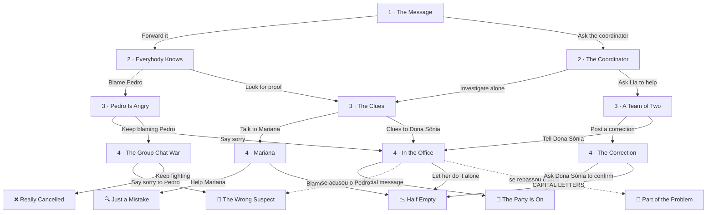

# Who Posted It? — roteiro

**Turma:** 1º ano · **Nível:** A2 · **Conteúdos:** Simple past, question words, sequence words
**Tema de fundo:** notícias falsas. Checar fonte, data e autoria antes de acreditar ou repassar.
**Formato:** 4 escolhas por leitura, 16 caminhos, 6 finais. Entre 350 e 430 palavras por caminho.

O `story.json` desta pasta já está no formato da *Story Shelf* e passou no
`checar.py`. Os 16 caminhos também foram jogados pela interface, com
ilustrações provisórias. Falta só desenhar as ilustrações (`scenes.js`).

---

## A história

Numa segunda à noite, um print aparece no grupo da turma: **"THE JUNE PARTY IS
CANCELLED 😢"**. Todo mundo acredita. As barracas de comida desistem, os
dançarinos faltam ao ensaio. Davi, amigo da Lia (os dois vêm de *The Phone on
the Bus*), decide descobrir quem postou.

**A verdade:** Mariana, líder da quadrilha, escreveu no grupo da dança:

> *Today's REHEARSAL is cancelled because of the rain. The June party is on Saturday! See you there! 🌽*

O primo dela, Caio, tirou um print, e o celular cortou a primeira linha.
Sobrou só *"...is cancelled"*, embaixo do nome do grupo. **Ninguém mentiu**: foi
um acidente que cresceu porque as pessoas repassaram sem checar.

**O suspeito óbvio (e inocente):** Pedro, o piadista da turma, que comemora
"no dancing for me!". Às 7:12 da noite ele estava no treino de futebol.

**As pistas que o leitor pode achar:** o print não tem data; tem o horário,
7:12 p.m.; mostra um pedaço do nome do grupo, *"...ha IFAL 🌽"*; e o Pedro
estava no treino na hora da mensagem.

**Personagens:** Davi (protagonista), Lia (melhor amiga), Pedro (o suspeito),
Mariana (líder da quadrilha), Caio (primo da Mariana), Dona Sônia
(coordenadora).

---

## Mapa dos caminhos

As setas pontilhadas são desvios automáticos: a escolha é a mesma, mas o final
muda por causa de algo que o leitor fez antes.

**Marcas que o leitor carrega:**

| Marca | Quando acontece | O que muda |
|---|---|---|
| `forwarded` | repassou o print no capítulo 1 | Cap. 3 *The Clues* começa com Davi arrependido; em *In the Office*, deixar a coordenadora sozinha leva a *Part of the Problem*; o final *The Party Is On* ganha uma linha de culpa |
| `accused` | acusou o Pedro no grupo | Pedro aparece bravo em *In the Office*, e o comunicado oficial leva a *The Wrong Suspect* |
| `team` | chamou a Lia para ajudar | A Lia aparece com o caderno de pistas em *In the Office* |

---

## Capítulos e caderno de detetive

| Capítulo | O que acontece | Pergunta do caderno | Escolhas |
|---|---|---|---|
| **1 · The Message** | O print chega na segunda à noite; a turma lamenta; a Lia pergunta se é verdade. | **When** did Davi see the message? | *Forward it to other groups* · *Ask the coordinator first* |
| **2 · Everybody Knows** | Davi repassou; na terça a escola inteira acredita; Pedro faz piada e vira suspeito; Davi nota que o print não tem data. | **What** was strange about the screenshot? | *Say in the group that Pedro did it* · *Look for proof first* |
| **2 · The Coordinator** | Dona Sônia não sabia de nada; o telefone não para de tocar; ela pede ajuda ao Davi. | **Why** was Dona Sônia's phone ringing? | *Investigate alone* · *Ask Lia to help* |
| **3 · The Clues** | Davi acha o horário, o pedaço do nome do grupo e lembra que o Pedro estava no treino. | **Where** did the screenshot come from? | *Talk to Mariana alone* · *Take the clues to Dona Sônia* |
| **3 · Pedro Is Angry** | Davi acusou o Pedro; o Pedro prova com uma foto que estava no treino. | **Where** was Pedro at 7:12 p.m.? | *Say sorry and look for the truth* · *Keep blaming Pedro* |
| **3 · A Team of Two** | Davi e Lia investigam juntos e chegam ao Caio, que só repassou. | **Who** posted the screenshot first? | *Post a correction with Caio's help* · *Take the information to Dona Sônia* |
| **4 · Mariana** | A Mariana mostra a mensagem original e percebe que foi cortada. | **What time** did Mariana send her message? | *Help Mariana send the full message* · *Say it was Mariana's fault* |
| **4 · In the Office** | Dona Sônia ouve tudo; faltam três dias para a festa. | **How many** days were there before the party? | *Write an official message together* · *Let Dona Sônia do it alone* |
| **4 · The Group Chat War** | O grupo vira uma briga; Dona Sônia chama os dois meninos. | **Who** did Dona Sônia call to her office? | *Stop and say sorry to Pedro* · *Keep fighting in the group* |
| **4 · The Correction** | Os três postam a mensagem completa; nem todo mundo acredita. | **How** did they prove the truth? | *Ask Dona Sônia to confirm it* · *Post more messages in capital letters* |

Cada final também tem uma pergunta, e cada caminho pratica de 4 a 5 question
words diferentes (*When, What, Why, Where, Who, What time, How many, How*).

---

## Os 6 finais

| Final | Faixa | O que acontece | Caminhos |
|---|---|---|---|
| 🎉 **The Party Is On** | bom | Comunicado oficial, festa cheia, fogueira; a Lia puxa o "detetive" para dançar. | 4 de 16 |
| 🔍 **Just a Mistake** | bom | A mensagem completa circula, e Davi reconstrói a cadeia: Mariana → família → Caio → turma. "Nobody lied." | 2 de 16 |
| 😬 **The Wrong Suspect** | intermediário | A festa acontece, mas antes Davi pede desculpas ao Pedro na frente da turma. "Next time, look for proof first." | 2 de 16 |
| 📉 **Half Empty** | intermediário | A verdade chega tarde; metade dos alunos vai à festa. "A lie travels fast. The truth needs help." | 5 de 16 |
| 🔁 **Part of the Problem** | ruim | O print que Davi repassou chegou a centenas de celulares; muitas famílias ficam em casa. | 2 de 16 |
| ❌ **Really Cancelled** | ruim | A briga no grupo cresce, e a coordenação cancela a festa de verdade. "The rumor was a lie, but the fight made it real." | 1 de 16 |

---

## Ilustrações para desenhar (`scenes.js`)

Mesmo estilo de *The Phone on the Bus*: SVG 540 × 220, com `person()`, `SKY()` e
`GROUND()`. **Os nomes das cenas não podem ter hífen** (use `phone_night`, não
`phone-night`): o `checar.py` só reconhece nomes simples.

**Personagens:** reaproveite a Lia e o Davi de *The Phone on the Bus*, para
serem reconhecíveis. Novos: **Pedro** (camisa de time de futebol, cabelo
curto), **Mariana** (cabelo preso, blusa de chita ou xadrez de quadrilha),
**Caio** (boné, jeito nervoso) e **Dona Sônia** (óculos, cabelo grisalho
preso).

| Cena | Onde aparece | O que mostrar |
|---|---|---|
| `phone_night` | capa, cap. 1 | Quarto à noite; Davi na cama com o celular iluminando o rosto; balões de mensagem saindo da tela. |
| `hall` | cap. 2 (*Everybody Knows*) | Pátio da escola de manhã; bandeirinhas de festa junina meio caídas; alunos cabisbaixos; Pedro rindo num canto. |
| `office` | cap. 2 (*The Coordinator*), cap. 4 (*In the Office*) | Sala da coordenação; Dona Sônia à mesa com o telefone; calendário na parede com o sábado circulado. |
| `clues` | cap. 3 (*The Clues*) | Close de um print gigante com lupa: topo cortado, "7:12 p.m." e "...ha IFAL 🌽" em destaque. |
| `chatwar` | cap. 3 (*Pedro Is Angry*), cap. 4 (*The Group Chat War*) | Celular grande com muitos balões, emojis bravos (😡) e setas para todo lado. |
| `library` | cap. 3 (*A Team of Two*) | Davi e Lia numa mesa da biblioteca com um caderno escrito *Who? When? Where?*. |
| `dance` | cap. 4 (*Mariana*) | Ginásio com dançarinos de quadrilha; Mariana mostrando o celular ao Davi. |
| `phone_day` | cap. 4 (*The Correction*) | Celular com a mensagem completa em destaque e "NOT CANCELLED" em verde; Davi, Lia e Caio ao lado. |
| `party` | finais *The Party Is On* e *Just a Mistake* | Festa junina à noite: bandeirinhas, fogueira, barracas, casais dançando. |
| `apology` | final *The Wrong Suspect* | Sala de aula; Davi estendendo a mão para o Pedro na frente da turma. |
| `empty` | finais *Half Empty* e *Part of the Problem* | A mesma festa com poucas pessoas, cadeiras vazias e uma barraca fechada. |
| `cancelled` | final *Really Cancelled* | Portão da escola à noite com uma placa "JUNE PARTY CANCELLED"; Davi sozinho. |

---

## Instruções para o Claude Code

1. Copie o `story.json` para `fonte/stories/who-posted-it/story.json`.
2. Crie `fonte/stories/who-posted-it/scenes.js` com as 12 cenas acima,
   registradas em `SCENE_LIB["who-posted-it"]`.
3. Acrescente `{"slug": "who-posted-it", "published": false}` ao
   `fonte/shelf.json`.
4. Rode `python3 fonte/checar.py` e `python3 fonte/build.py --drafts`, e leia ao
   menos dois caminhos em largura de celular.
5. Só mude para `"published": true` quando o professor aprovar.

**Dois pontos do motor para corrigir** (não afetam esta história, mas podem
afetar as próximas):

- **Ordem do `alt`:** quando uma escolha tem mais de um desvio (`alt`) e o
  leitor tem mais de uma marca, o `template.html` usa o **último** desvio que
  combina e o `checar.py` usa o **primeiro**. Os dois precisam seguir a mesma
  regra. Sugestão: o primeiro que combinar vence, nos dois arquivos, e isso
  entra no README. Esta história usa no máximo um `alt` por escolha, então não
  é afetada.
- **Nomes de cena com hífen:** hoje o `checar.py` não reconhece nomes como
  `phone-night` (que no JavaScript precisariam de aspas). Documente no
  `CLAUDE.md` e no modelo que os nomes devem ser simples, ou ensine o
  verificador a aceitar nomes entre aspas.

**Falsos positivos do glossário, já tratados:** *food stands* (substantivo, e
não o verbo *stand*) e *really mean* (adjetivo, e não o verbo *mean*) estão
marcados com `[[...]]`.
